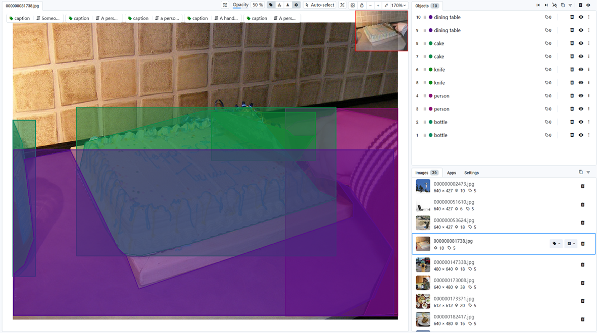
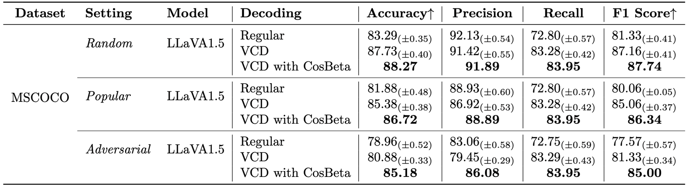

# Reducing Hallucinations of LVLMs: Improving VCD with Cosine-Beta Noise Scheduling

This is the official GitHub repository of Reducing Hallucinations of LVLMs: Improving VCD with Cosine-Beta Noise Scheduling. In this project, we employed a cosine-beta diffusion noise scheduler that can further improve the performance of the state-of-the-art train-free method VCD in the task of reducing hallucinations of LVLMs.

##  Usage

### Environment Setup
```bash
conda create -yn Reducing-Hallucinations-of-LVLMs python=3.11
conda activate Reducing-Hallucinations-of-LVLMs
pip install -r requirements.txt
```

### Accessing the COCO 2014 Dataset

Please download and decompress the [COCO2014](https://www.kaggle.com/datasets/jeffaudi/coco-2014-dataset-for-yolov3) dataset to the project root directory.



### Reproducing Results

Please use the below bash commands to eval our built POPEs. The first script is for inferring based on the questions files, and the second is for evaluating final results based on question and answer files.

```bash
python object_hallucination_vqa_llava.py
python eval_POPE.py
```

You can adjust hyperparameters in any of the above files to test with different settings. For more details, please refer to the [VCD](https://github.com/DAMO-NLP-SG/VCD?tab=readme-ov-file) codebase and the [POPE](https://github.com/RUCAIBox/POPE) codebase.

### Playing with Different Noise Schedulers

You can also switch back to the original sigmoid-beta noise scheduler in the `vcd_utils/vcd_add_noise.py` file.

## Experiments

**VCD-CosBeta further mitigates the object hallucination issue based on VCD.**


*table 1. Results on POPE. Regular decoding denotes direct sampling, whereas VCD refers to sampling from our proposed contrastive distribution pvcd. VCD with CosBeta refers to our methods.*

## Citation

## Related Projects

- [COCO2014](https://www.kaggle.com/datasets/jeffaudi/coco-2014-dataset-for-yolov3)
- [VCD](https://github.com/DAMO-NLP-SG/VCD?tab=readme-ov-file)
- [POPE](https://github.com/RUCAIBox/POPE)
- [Improved Denoising Diffusion Probabilistic Models](https://arxiv.org/pdf/2102.09672)
- [On the Importance of Noise Scheduling for Diffusion Models](https://arxiv.org/pdf/2301.10972)
- [LLaVA 1.5](https://github.com/haotian-liu/LLaVA)